# Laporan Proyek Machine Learning - Sinta Ezra Wati Gulo

## Domain Proyek: Kesehatan
### Latar Belakang
Diabetes mellitus merupakan salah satu penyakit tidak menular kronis yang ditandai dengan tingginya kadar gula darah akibat gangguan produksi atau fungsi insulin dalam tubuh. Penyakit ini mencakup berbagai tipe, termasuk diabetes tipe 1, tipe 2, dan gestasional, dengan tipe 2 sebagai yang paling umum. Namun secara keseluruhan, diabetes telah menjadi tantangan kesehatan global yang serius dan terus mengalami peningkatan prevalensi.

International Diabetes Federation (IDF) pada tahun 2021 melaporkan bahwa terdapat sekitar 537 juta orang dewasa hidup dengan diabetes di seluruh dunia, dan angka ini diproyeksikan akan meningkat menjadi 783 juta pada tahun 2045 (Magliano et al., 2021). Di Indonesia, tren serupa juga terlihat seiring dengan perubahan gaya hidup, pola makan, dan tingkat aktivitas fisik masyarakat. Kondisi ini tidak hanya berdampak pada kualitas hidup individu, tetapi juga memberikan beban signifikan terhadap sistem pelayanan kesehatan dan produktivitas ekonomi nasional.

Upaya deteksi dini menjadi sangat krusial untuk mencegah terjadinya komplikasi jangka panjang seperti penyakit jantung, gagal ginjal, kerusakan saraf, dan kehilangan penglihatan. Sayangnya, banyak penderita diabetes yang tidak menyadari kondisinya hingga memasuki tahap lanjut. Di sinilah teknologi, khususnya kecerdasan buatan dan machine learning, memainkan peran penting dalam mengidentifikasi risiko diabetes secara lebih cepat, akurat, dan efisien berbasis data kesehatan individu.

### Referensi
Magliano, D. J., Boyko, E. J., & IDF Diabetes Atlas 10th Edition Scientific Committee. (2021). Global, regional and country-level diabetes prevalence estimates for 2021 and projections for 2045: Results from the International Diabetes Federation Diabetes Atlas, 10th edition. *Diabetes Research and Clinical Practice, 183*, 109119. [https://doi.org/10.1016/j.diabres.2021.109119](https://doi.org/10.1016/j.diabres.2021.109119)

Kavakiotis, I., Tsave, O., Salifoglou, A., Maglaveras, N., Vlahavas, I., & Chouvarda, I. (2017). Machine learning and data mining methods in diabetes research. *Computational and Structural Biotechnology Journal, 15*, 104–116. [https://doi.org/10.1016/j.csbj.2016.12.005](https://doi.org/10.1016/j.csbj.2016.12.005)

## Business Understanding
### Problem Statements
- Bagaimana memprediksi status seseorang menderita diabetes (positif/negatif) berdasarkan data kesehatan seperti gender, usia, BMI, level HbA1c, kadar glukosa darah, serta riwayat merokok dan penyakit penyerta (seperti hypertension dan heart disease)?
- Algoritma machine learning mana yang memberikan hasil klasifikasi terbaik dalam mendeteksi diabetes berdasarkan data yang tersedia?
- Apa fitur yang paling berpengaruh terhadap kemungkinan seseorang mengidap diabetes?

### Goals
- Mengembangkan sistem prediksi berbasis machine learning yang mampu mengklasifikasikan status diabetes seseorang secara akurat.
- Membandingkan performa beberapa model klasifikasi untuk menentukan algoritma yang paling optimal dalam konteks ini.
- Melakukan eksplorasi terhadap pengaruh berbagai fitur dalam menentukan risiko diabetes.

### Solution statements
- Menggunakan beberapa algoritma klasifikasi untuk membangun model prediksi diabetes, yaitu:
  - Logistic Regression
  - K-Nearest Neighbors (KNN)
  - Support Vector Classifier (SVC)
  - Decision Tree Classifier
  - Random Forest Classifier
- Melakukan serangkaian tahapan preprocessing data seperti:
  - Menghapus data duplikat
  - Menangani missing value dan outlier
  - Encoding data kategorikal dan standarisasi fitur numerikal
- Melatih dan mengevaluasi model menggunakan metrik evaluasi klasifikasi:
  - Accuracy
  - Precision
  - Recall
  - F1-score
  - ROC-AUC
- Membandingkan hasil evaluasi antar model untuk memilih model terbaik yang akan dijadikan solusi akhir.
- Melakukan hyperparameter tuning pada model terbaik untuk mengoptimalkan performa berdasarkan metrik evaluasi.

## Data Understanding
Proyek ini menggunakan dataset Diabetes prediction dataset yang dapat diakses melalui Kaggle pada link berikut [Diabetes prediction dataset](https://www.kaggle.com/datasets/iammustafatz/diabetes-prediction-dataset).

### Variabel-variabel pada Diabetes prediction dataset adalah sebagai berikut:
* `gender`: mengacu pada jenis kelamin biologis seseorang, yang dapat memengaruhi kerentanan terhadap diabetes. Terdapat tiga kategori: laki-laki, perempuan, dan lainnya.
* `age`: faktor penting karena diabetes lebih sering terdiagnosis pada orang dewasa yang lebih tua. Rentang usia dalam dataset ini adalah 0–80 tahun.
* `hypertension`: kondisi medis di mana tekanan darah dalam arteri terus-menerus tinggi. Bernilai 0 atau 1, di mana: 0 berarti tidak memiliki hipertensi dan 1 berarti memiliki hipertensi.
* `heart_disease`:  kondisi medis lain yang berkaitan dengan peningkatan risiko diabetes. Bernilai 0 atau 1, di mana: 0 berarti tidak memiliki penyakit jantung dan 1 berarti memiliki penyakit jantung.
* `smoking_history`: riwayat merokok juga dianggap sebagai faktor risiko diabetes dan dapat memperburuk komplikasi diabetes. Dalam dataset ini, terdapat 6 kategori yaitu not current, former, No Info, current, never, dan ever.
* `bmi `: ukuran lemak tubuh berdasarkan berat dan tinggi badan. Nilai BMI yang tinggi dikaitkan dengan risiko diabetes yang lebih besar Rentang BMI dalam dataset adalah 10.16 – 71.55. Kategori BMI pada dataset ini yaitu <18.5 = berat badan kurang, 18.5–24.9 = normal, 25–29.9 = kelebihan berat badan, dan ≥30 = obesitas.
* `HbA1c_level`: HbA1c (Hemoglobin A1c) mengukur rata-rata kadar gula darah selama 2–3 bulan terakhir. Nilai yang lebih tinggi menunjukkan risiko lebih besar terkena diabetes.
Umumnya, HbA1c > 6.5% menunjukkan diabetes.
* `blood_glucose_level`:  mengacu pada jumlah gula dalam aliran darah pada satu waktu. Kadar glukosa darah yang tinggi merupakan indikator utama diabetes.
* `diabetes`: variabel target yang diprediksi dalam dataset, dengan 1 menunjukkan menderita diabetes dan 0 menunjukkan tidak menderita diabetes.

### Exploratory Data Analysis 
1. Informasi dataset
   <br>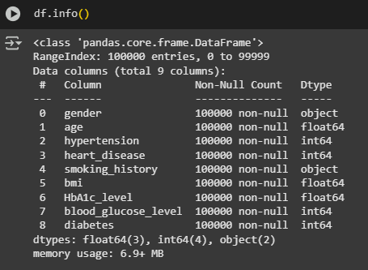
   - Ada 100.000 baris dalam dataset.
   - Terdapat 9 kolom yaitu: gender, age, hypertension, heart_disease, smoking_history, bmi, HbA1c_level, blood_glucose_level, dan diabetes.
3. Memeriksa duplikat data pada dataset
   <br>
   <br>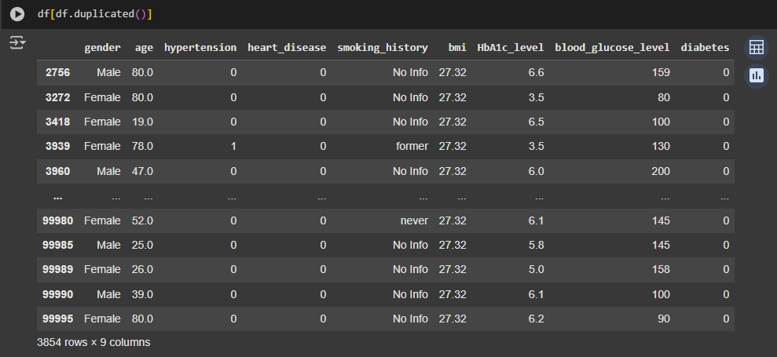
   <br>Terlihat bahwa terdapat data duplikat pada dataset ini sebanyak 3.854, sehingga data duplikat tersebut perlu dihapus agar memudahkan proses modeling nantinya.
5. Deskripsi statistik fitur numerik dataset
   <br>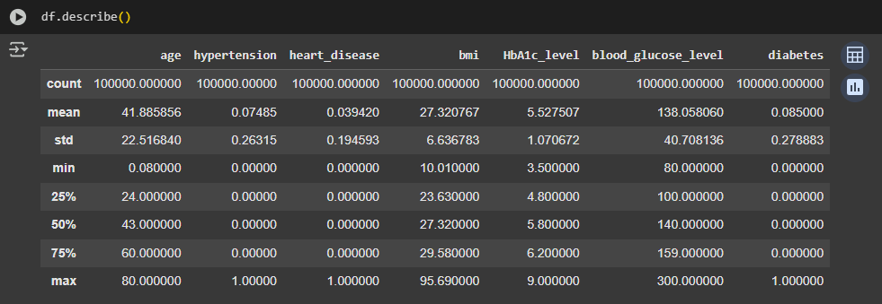
   <br>Secara keseluruhan, statistik ini menunjukkan bahwa dataset memiliki keragaman yang cukup tinggi pada usia dan BMI, dan sebagian besar pasien tidak memiliki penyakit penyerta (hipertensi/penyakit jantung).
7. Memeriksa missing value
   <br>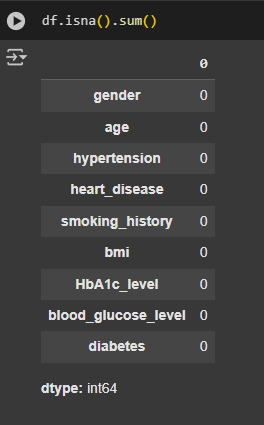
   <br>Tidak terdapat missing value pada dataset ini.
8. Memeriksa outliers
   - `age`
     <br>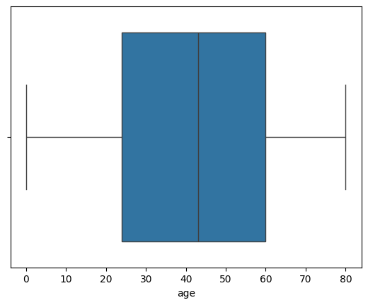
   - `hypertension`
     <br>
   - `heart_disease`
     <br>
   - `bmi`
     <br>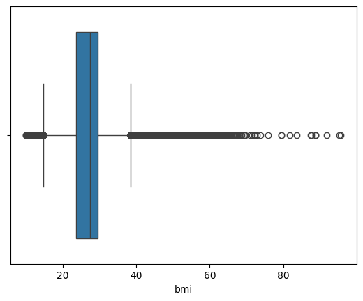
   - `HbA1c_level`
     <br>
   - `blood_glucose_level`
     <br>
   <br>Visualisasi menunjukkan bahwa bmi, HbA1c_level, dan blood_glucose_level terdapat outliers sehingga perlu ditangani.
9. Univariate Analysis
   <br>Melakukan proses analisis data dengan teknik Univariate EDA. Dimana disini data akan dibagi menjadi dua bagian, yaitu numerical features dan categorical. Visualisasi pada bagian ini menunjukkan distribusi masing-masing fitur pada dataset.
   - Fitur kategorikal
     - `gender`
         
       | Gender | Jumlah Sampel | Persentase (%) |
       | ------ | ------------- | -------------- |
       | Female | 58,552        | 58.6           |
       | Male   | 41,430        | 41.4           |
       | Other  | 18            | 0.0            |

       <br>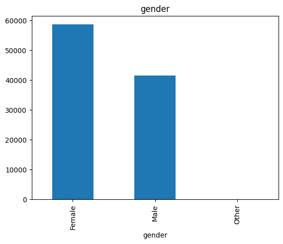
       <br>Dari data persentase dapat kita simpulkan bahwa ebagian besar data didominasi oleh gender Female (58.6%), diikuti oleh Male (41.4%), sementara kategori Other hampir tidak signifikan karena hanya mencakup 0.0% dari total data (hanya 18 sampel).
     
     - `smoking_history`
     
        | Smoking History | Jumlah Sampel | Persentase (%) |
        | --------------- | ------------- | -------------- |
        | No Info         | 35,816        | 35.8           |
        | never           | 35,095        | 35.1           |
        | former          | 9,352         | 9.4            |
        | current         | 9,286         | 9.3            |
        | not current     | 6,447         | 6.4            |
        | ever            | 4,004         | 4.0            |

       <br>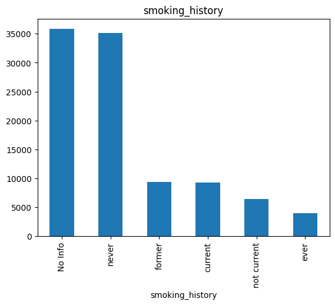
       <br>Mayoritas data berasal dari individu dengan riwayat merokok yang tidak diketahui atau tidak diisi (kategori No Info) sebanyak 35.8%, yang berarti terdapat kekosongan informasi yang cukup besar dalam fitur ini. Selain itu, proporsi terbesar berikutnya adalah yang tidak pernah merokok (kategori never) sebesar 35.1%. Kategori lainnya menunjukkan bahwa sebagian kecil populasi merupakan perokok aktif atau mantan perokok.
   - Fitur numerik
     <br>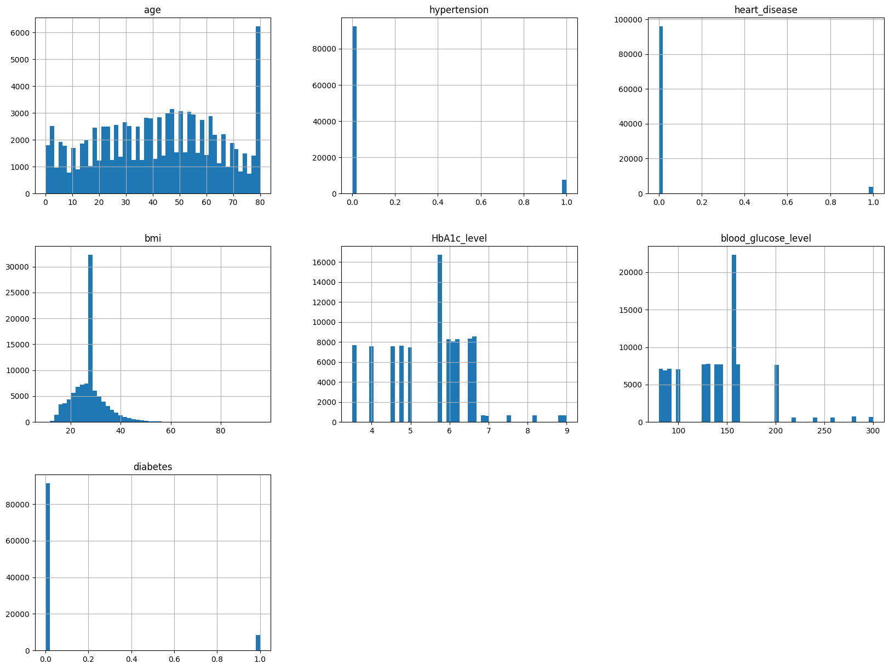
     <br>Dataset menunjukkan beberapa ketidakseimbangan dan kejanggalan distribusi. Usia tersebar cukup merata namun terdapat outlier signifikan di usia 80, kemungkinan akibat nilai default. Fitur kesehatan seperti hypertension, heart_disease, dan diabetes sangat imbalanced, dengan mayoritas bernilai nol (tidak sakit). Data BMI dan HbA1c_level memperlihatkan pola distribusi yang tidak alami, menunjukkan kemungkinan adanya nilai default atau pengisian massal, sementara blood_glucose_level juga tampak berpola dan tidak kontinu, dengan konsentrasi data pada nilai tertentu. Hal ini menunjukkan perlunya pembersihan dan penyeimbangan data sebelum digunakan untuk pemodelan.
10. Multivariate Analysis
   <br>Pada tahapan ini melakukan analisis data pada fitur kategori dan numerik terhadap target (diabetes).
   - Fitur kategorikal
     <br>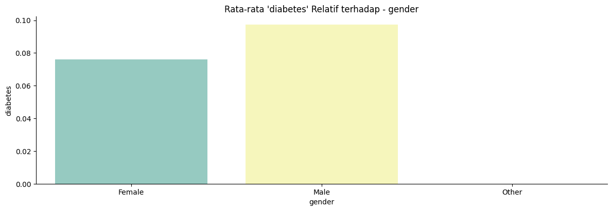
     <br>Gender tampaknya memiliki pengaruh terhadap prevalensi diabetes, dengan laki-laki menunjukkan kecenderungan lebih tinggi terkena diabetes dibanding perempuan.
     <br>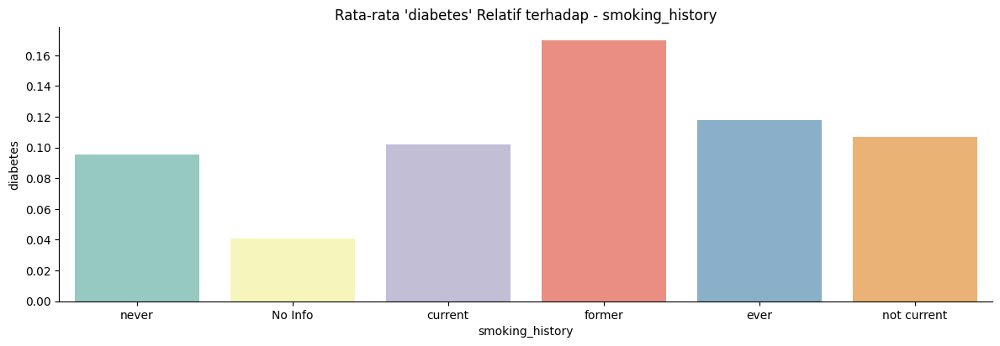
     <br>Riwayat merokok berhubungan dengan prevalensi diabetes. Mantan perokok memiliki risiko tertinggi, yang bisa jadi disebabkan oleh dampak kumulatif merokok di masa lalu.
     
   - Fitur numerik
     <br>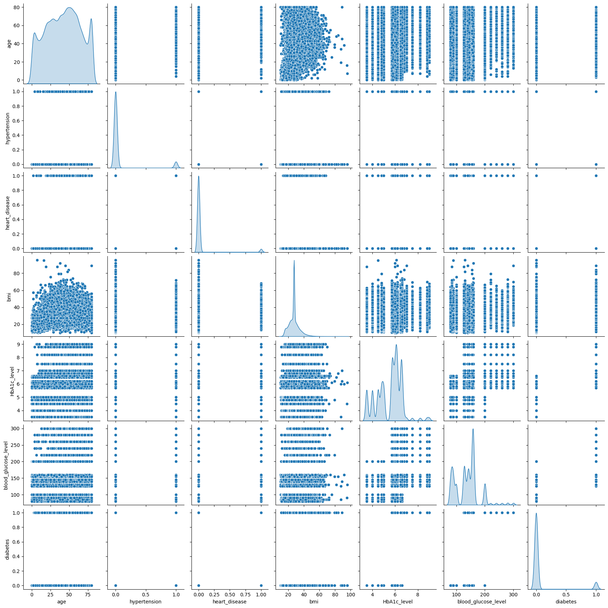
     <br>Pada pola sebaran data grafik pairplot, terlihat bahwa age, HbA1c_level, blood_glucose_level, dan bmi memiliki korelasi yang cukup kuat dengan fitur target diabetes.
     <br>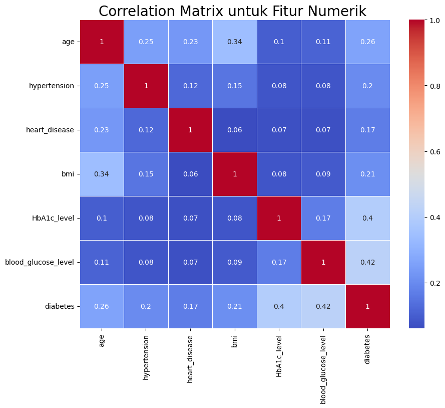
     <br>Terlihat bahwa fitur HbA1c_level, age, dan blood_glucose_level memiliki korelasi yang cukup berarti dengan diabetes. Sementara itu, fitur bmi, heart_disease, dan hypertension memiliki korelasi yang cukup lemah terhadap target.

## Data Preparation
Pada bagian ini akan dilakukan 5 tahap persiapan data, yaitu:
1. Menangani Data Duplikat
   <br>Pada tahapan ini, data duplikat ditangani dengan cara menghapus data duplikat tersebut. Data duplikat dapat mengakibatkan bias analisis dan model overfitting karena nilai yang sama dihitung lebih dari sekali. Menghapus baris duplikat bertujuan memastikan keunikan dan integritas data sebelum melanjutkan ke tahap transformasi dan modeling.
   <br>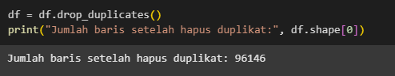
2. Menangani Outliers
   <br>Outliers adalah nilai data yang secara signifikan berbeda atau menyimpang jauh dari sebagian besar nilai lainnya dalam dataset. Menangani outliers penting untuk meningkatkan akurasi, kualitas, dan keandalan hasil analisis serta model prediktif. Outlier dideteksi dan pada tahap ini ditangani dengan menghapus data outliers tersebut.
   <br>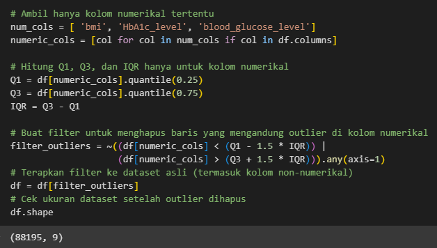
   <br>Menangani outlier dengan IQR Method, dimana:<br>
   - Kuartil:
     - Q1 (Kuartil 1) = nilai pada persentil ke-25
     - Q3 (Kuartil 3) = nilai pada persentil ke-75
   - IQR (Interquartile Range):
     - IQR = Q3 - Q1
   - Batas Outlier:
     - Lower Bound = Q1 - 1.5 × IQR
     - Upper Bound = Q3 + 1.5 × IQR
3. Encoding Fitur Kategori
   <br>Mengubah data kategorik menjadi numerik agar bisa diproses oleh algoritma machine learning, dalam kasus ini menggunakan One-Hot Encoding dan Label Encoding. Karena algoritma machine learning pada umumnya hanya dapat memproses data numerik, sehingga untuk memudahkan proses pemodelan, data kategorik harus diencoding.
   <br>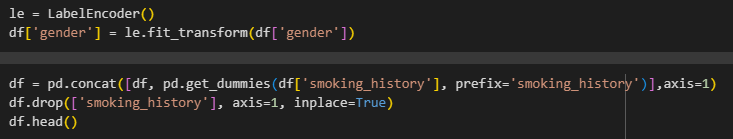
4. Train-Test-Split
   <br>Dataset dibagi menjadi data latih (train) dan data uji (test) menggunakan train_test_split dari sklearn dengan rasio 80:20. Hal ini dilakukan untuk memisahkan data pada proses pelatihan dan evaluasi model.
   <br>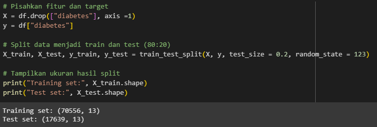
5. Standarisasi
   <br>Proses penskalaan fitur numerik agar berada dalam rentang yang seragam menggunakan StandardScaler. Hal ini bertujuan agar model bekerja adil dan optimal terhadap semua fitur, serta tidak ada bias skala.
   <br>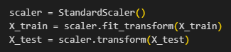

## Modeling
<br>Tahapan ini bertujuan membangun model machine learning untuk memprediksi status diabetes (positif/negatif) berdasarkan fitur kesehatan yang tersedia. Pada proyek ini, saya membangun lima model machine learning, yaitu:
1. Logistic Regression
```python
# Model Logistic
logistic = LogisticRegression(class_weight='balanced', max_iter=1000)
logistic.fit(X_train,y_train)
```
- Tahapan:
  - Inisialisasi model Logistic Regression.
  - Menyeimbangkan kelas target agar model tidak bias terhadap kelas mayoritas.
  - Melatih model menggunakan data train.
- Parameter:
  - class_weight='balanced': menghitung bobot kelas secara otomatis berdasarkan distribusi kelas.
  - max_iter=1000: untuk menentukan jumlah maksimum iterasi agar konvergen.

2. K-Nearest Neighbors (KNN)
```python
# Model KNN
knn = KNeighborsClassifier(n_neighbors=5, p=2, weights='distance', metric = 'minkowski')
knn.fit(X_train,y_train)
```
- Tahapan:
  - Inisialisasi model KNN.
  - Menentukan parameter jumlah tetangga dan metode pembobotan.
  - Melatih model dengan menyimpan data latih.
- Parameter:
  - n_neighbors=5: menggunakan 5 tetangga terdekat.
  - p=2: menggunakan jarak Euclidean (karena p=2).
  - weights='distance': tetangga yang lebih dekat memiliki bobot lebih besar.
  - metric='minkowski': metode pengukuran jarak umum, digunakan bersama p.

3. Support Vector Classifier (SVC)
```python
# Model SVC
svc = SVC(kernel = 'rbf', C=1.0, gamma='scale', class_weight='balanced', probability=True, random_state = 42)
svc.fit(X_train,y_train)
```
- Tahapan:
  - Inisialisasi model SVC.
  - Menentukan kernel dan parameter regulasi.
  - Melatih model untuk memisahkan kelas dengan margin maksimum.
- Parameter:
  - kernel='rbf': menggunakan fungsi kernel radial basis (non-linear).
  - C=1.0: Parameter regulasi untuk mengontrol overfitting.
  - gamma='scale': parameter kernel otomatis berdasarkan data.
  - class_weight='balanced': menyesuaikan bobot kelas minoritas.
  - probability=True: mengaktifkan prediksi probabilitas.
  - random_state=42: menjamin hasil yang konsisten.

4. Decision Tree
```python
# Model Decision Tree
decisionTree = DecisionTreeClassifier(criterion= 'entropy', class_weight='balanced', random_state=42)
decisionTree.fit(X_train,y_train)
```
- Tahapan:
  - Inisialisasi model decision tree.
  - Menentukan strategi pemisahan node menggunakan entropy.
  - Melatih model berdasarkan data pelatihan.
- Parameter:
  - criterion='entropy': menggunakan informasi gain untuk membagi node.
  - class_weight='balanced': untuk menyesuaikan bobot kelas minoritas.
  - random_state=42: agar hasil selalu konsisten.

5. Random Forest
```python
# Model Random Forest
rf = RandomForestClassifier(n_estimators=10, criterion= 'entropy', class_weight='balanced', random_state=42)
rf.fit(X_train,y_train)
```
- Tahapan:
  - Inisialisasi model
  - Menentukan jumlah pohon dan kriteria pemisahan.
  - Melatih model dengan membangun banyak decision tree.
- Parameter:
  - n_estimators=10: jumlah pohon dalam hutan.
  - criterion='entropy': untuk membagi node.
  - class_weight='balanced': untuk menyeimbangkan kontribusi tiap kelas.
  - random_state=42: untuk replikasi hasil.


**Kelebihan dan kekurangan dari setiap algoritma yang digunakan**
| **Algoritma**                       | **Kelebihan**                                                                                                                                           | **Kekurangan**                                                                                                          |
| ----------------------------------- | ------------------------------------------------------------------------------------------------------------------------------------------------------- | ----------------------------------------------------------------------------------------------------------------------- |
| **Logistic Regression**             | - Sederhana dan cepat dalam pelatihan<br>- Hasilnya mudah diinterpretasikan<br>- Cocok untuk prediksi probabilistik                                     | - Kurang optimal untuk hubungan non-linear<br>- Rentan terhadap multikolinearitas antar fitur                           |
| **Support Vector Classifier (SVC)** | - Efektif untuk data berdimensi tinggi<br>- Mampu memisahkan kelas dengan margin maksimal<br>- Mendukung kernel non-linear                              | - Sensitif terhadap pemilihan parameter (C, gamma)<br>- Waktu komputasi tinggi untuk data besar                         |
| **K-Nearest Neighbors (KNN)**       | - Mudah dipahami dan diimplementasikan<br>- Tidak memerlukan proses pelatihan (lazy learning)<br>- Non-parametrik (tidak mengasumsikan distribusi data) | - Lambat pada dataset besar karena menghitung jarak setiap kali prediksi<br>- Sensitif terhadap outlier dan skala fitur |
| **Decision Tree**                   | - Mudah dibaca dan divisualisasikan<br>- Tidak memerlukan normalisasi fitur<br>- Dapat menangani data numerik dan kategorik                             | - Mudah overfitting jika tidak dilakukan pruning<br>- Tidak stabil terhadap perubahan kecil pada data                   |
| **Random Forest**                   | - Lebih akurat dibanding satu pohon (ensembling)<br>- Mengurangi overfitting melalui agregasi<br>- Tahan terhadap noise dan outlier                     | - Interpretabilitas lebih rendah dibanding decision tree<br>- Membutuhkan waktu dan resource lebih banyak               |


**Model Terbaik: Random Forest**
<br>Random Forest dipilih sebagai model terbaik karena memberikan hasil evaluasi paling tinggi dan seimbang pada data uji, tahan terhadap overfitting, serta mampu menangani data tidak seimbang dengan baik. Kombinasi antara akurasi tinggi dan metrik klasifikasi yang kuat menjadikannya pilihan yang optimal untuk menyelesaikan permasalahan klasifikasi ini. Untuk lebih jelasnya, dapat dilihat pada Evaluation.

**Melakukan Hyperparameter Tuning pada Model Terbaik**
```python
# Grid parameter yang akan diuji
param_grid = {
    'n_estimators': [100, 200],
    'max_depth': [None, 20],
    'min_samples_split': [2, 5],
    'min_samples_leaf': [1, 2],
    'max_features': ['sqrt']
}

# Setup GridSearch
grid_search = GridSearchCV(
    estimator=rf,
    param_grid=param_grid,
    cv=5,
    scoring='f1',
    n_jobs=-1,
    verbose=0
)
```
Hyperparameter tuning bertujuan untuk mencari kombinasi parameter terbaik agar performa model (model terbaik: Random Forest) meningkat, terutama pada metrik F1-score karena:
- Data bersifat tidak seimbang (kelas minoritas penting)
- F1-score mempertimbangkan keseimbangan antara precision dan recall
<br>Metode yang digunakan adalah GridSearchCV, yang mana digunakan untuk melakukan pencarian kombinasi hyperparameter terbaik secara eksploratif melalui pencarian grid (grid search) dengan cross-validation (cv=5).

| Hyperparameter      | Deskripsi                                                               |
| ------------------- | ----------------------------------------------------------------------- |
| `n_estimators`      | Jumlah pohon dalam forest. Dicoba nilai 100 dan 200.                    |
| `max_depth`         | Kedalaman maksimal pohon. Dicoba `None` (bebas) dan 20.                 |
| `min_samples_split` | Minimum jumlah data yang dibutuhkan untuk membagi node. Dicoba 2 dan 5. |
| `min_samples_leaf`  | Minimum jumlah data di setiap daun. Dicoba 1 dan 2.                     |
| `max_features`      | Jumlah fitur yang dipertimbangkan saat membagi. Dicoba `'sqrt'`.        |


## Evaluation
**Metrik yang Digunakan**
1. Accuracy, yaitu persentase prediksi yang benar terhadap seluruh data.
   <br>Formula:
   
   $$
     \text{Accuracy} = \frac{TP + TN}{TP + TN + FP + FN}
   $$
   
   <br>Keterangan:
   - TP = True Positive (Data positif yang diprediksi benar sebagai positif)
   - TN = True Negative (Data negatif yang diprediksi benar sebagai negatif)
   - FP = False Positive (Data negatif yang salah diprediksi sebagai positif)
   - FN = False Negative (Data positif yang salah diprediksi sebagai negatif)

2. Precision, yaitu proporsi data yang diprediksi positif yang benar-benar positif. Metrik ini cocok digunakan saat false positive harus diminimalkan.
   <br>Formula:<br>
   
$$
  \text{Precision} = \frac{TP}{TP + FP}
$$
   
3. Recall (Sensitivity), yaitu roporsi data positif yang berhasil dikenali model. Penting jika false negative berisiko tinggi, seperti pada kasus deteksi penyakit.
   <br>Formula:<br>
   
$$
  \text{Recall} = \frac{TP}{TP + FN}
$$

4. F1-Score, yaitu harmonic mean dari Precision dan Recall. Digunakan saat perlu keseimbangan antara Precision dan Recall.

   <br>Formula:<br>
   
$$
  \text{F1 Score} = 2 \times  \frac{\text{Precision} \times  \text{Recall}}{\text{Precision} + \text{Recall}}
$$

5. ROC-AUC (Receiver Operating Characteristic - Area Under Curve), yaitu luas area di bawah kurva ROC, yang menggambarkan trade-off antara True Positive Rate (TPR) dan False Positive Rate (FPR).
   - Nilai maksimal adalah 1 (semakin mendekati 1 semakin baik).
   - Tidak bergantung pada threshold tertentu.

**Hasil Evaluasi**
| **Metrik**    | **LogisticRegression** | **KNN**  | **SVC**  | **DecisionTree** | **RandomForest** | **RandomForest (setelah tuning)** |
| ------------- | ---------------------- | -------- | -------- | ---------------- | ---------------- | --------------------------------- |
| **Accuracy**  | 0.845229               | 0.959068 | 0.843869 | 0.953966         | 0.969783         | 0.970747                          |
| **Precision** | 0.237569               | 0.688312 | 0.242612 | 0.560170         | 0.840278         | 0.88                              |
| **Recall**    | 0.883243               | 0.401081 | 0.931892 | 0.568649         | 0.523243         | 0.51                              |
| **F1-score**  | 0.374427               | 0.506831 | 0.384993 | 0.564378         | 0.644903         | 0.65                              |
| **ROC-AUC**   | 0.942800               | 0.831969 | 0.943392 | 0.772177         | 0.884897         | 0.947724                          |


| Model                  | Train Accuracy | Test Accuracy |
| ---------------------- | -------------- | ------------- |
| Logistic Regression    | 0.845187       | 0.845229      |
| KNN                    | 0.999164       | 0.959068      |
| SVC                    | 0.844889       | 0.843869      |
| Decision Tree          | 0.999164       | 0.953966      |
| Random Forest          | 0.994416       | 0.969783      |
| Random Forest (Tuning) | 0.999164       | 0.970747      |


**Visualisasi**
- Confusion Matrix Kelima Model yang Dibangun
  <br>
- Perbandingan Akurasi pada Setiap Model
  <br>
- Perbandingan Metrik pada Setiap Model
  <br>
- Perbandingan Hasil Prediksi dan Nilai Aktual (Randomm Forest - setelah tuning)
  <br>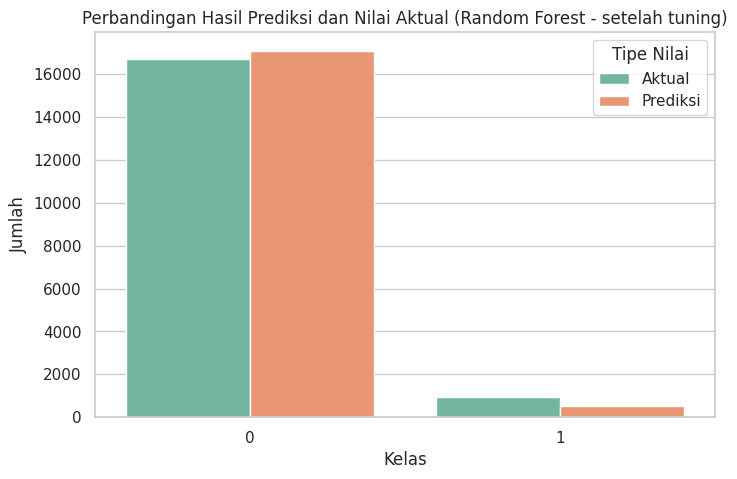
- Feature Importance Berdasarkan Random Forest (setelah tuning)
  <br>


<br>Berdasarkan hasil evaluasi menggunakan metrik-metrik seperti accuracy, precision, recall, F1-score, dan ROC-AUC, dapat disimpulkan bahwa model Random Forest terutama setelah dilakukan hyperparameter tuning merupakan model terbaik secara keseluruhan untuk kasus ini. Hal ini didasarkan pada poin-poin berikut:
1. Performa Evaluasi Terbaik:
   - Model Random Forest (setelah tuning) memperoleh skor tertinggi pada sebagian besar metrik penting seperti accuracy (97.07%), precision (88%), F1-score (0.65), dan ROC-AUC (0.947).
   - Meskipun recall-nya (0.51) lebih rendah dibandingkan model Logistic Regression (0.88) dan SVC (0.93), trade-off ini masih dapat diterima, terutama karena precision meningkat secara signifikan. Hal ini berarti model lebih baik dalam menghindari false positives, yang mungkin penting dalam konteks data ini tergantung pada problem statement.
2. Trade-off yang Seimbang:
   - Dalam konteks klasifikasi yang memiliki ketimpangan kelas (class imbalance), F1-score dan ROC-AUC menjadi metrik yang lebih representatif dibandingkan hanya mengandalkan accuracy.
   - Random Forest (setelah tuning) memberikan keseimbangan terbaik antara precision dan recall, ditunjukkan dari F1-score tertinggi (0.65), yang merepresentasikan kompromi optimal antara keduanya.
3. Performa Training dan Testing:
   - Tuning pada Random Forest meningkatkan test accuracy dari 96.97% menjadi 97.07%, menunjukkan bahwa tuning memberikan peningkatan meskipun tidak terlalu besar.
   - Meskipun train accuracy-nya sangat tinggi (99.91%), yang menunjukkan adanya sedikit overfitting, namun selisih train-test accuracy masih dalam batas yang dapat diterima, dan generalisasi model masih tergolong baik.
4. Model Lain sebagai Pembanding:
   - KNN dan Decision Tree menunjukkan performa yang tinggi di training set namun mengalami penurunan di test set, mengindikasikan overfitting yang lebih parah.
   - Logistic Regression dan SVC memiliki recall tinggi namun precision dan F1-score-nya sangat rendah, yang kurang ideal jika false positive berdampak signifikan dalam konteks penggunaan model.

Kesimpulan akhir:
<br>Model Random Forest dengan hyperparameter tuning adalah pilihan paling tepat sebagai model terbaik, karena memberikan keseimbangan performa terbaik dan hasil evaluasi yang unggul secara umum. Pemilihan metrik seperti F1-score dan ROC-AUC yang lebih representatif daripada sekadar akurasi sangat penting dalam konteks ini, terutama jika data tidak seimbang atau konsekuensi kesalahan klasifikasi berbeda antara kelas.

## Conclusion
1. Menjawab Problem Statement
   - Model klasifikasi yang dibangun berhasil memprediksi status diabetes seseorang (positif atau negatif) berdasarkan variabel-variabel kesehatan seperti usia, jenis kelamin, BMI, kadar HbA1c, kadar glukosa darah, riwayat hipertensi dan penyakit jantung, serta kebiasaan merokok.
   - Dari hasil evaluasi performa lima algoritma klasifikasi, Random Forest Classifier terbukti menjadi model terbaik terutama setelah dilakukan proses hyperparameter tuning. Model ini memberikan hasil prediksi yang seimbang dan akurat, bahkan pada kelas minoritas (positif diabetes), dengan ROC-AUC mencapai 0.9477.
   - Selain itu, melalui analisis feature importance dari model Random Forest, dapat disimpulkan bahwa HbA1c_level, blood_glucose_level, gender, dan bmi merupakan faktor yang paling berpengaruh terhadap kemungkinan seseorang mengidap diabetes.

2. Mencapai Goals
   <br>Proyek ini berhasil mengembangkan sistem klasifikasi diabetes berbasis machine learning yang:
    - Mampu mengklasifikasikan status diabetes secara akurat menggunakan data medis.
    - Membandingkan performa lima algoritma klasifikasi secara objektif menggunakan metrik evaluasi seperti accuracy, precision, recall, F1-score, dan ROC-AUC.
    - Menentukan algoritma optimal (Random Forest) melalui hyperparameter tuning untuk meningkatkan performa deteksi.
    - Memberikan insight terhadap fitur yang paling berkontribusi dalam prediksi diabetes, sehingga hasil dapat digunakan sebagai rekomendasi pendukung keputusan medis.

4. Dampak Solusi Statement
   <br>Solusi yang dibangun bersifat aplikatif dan siap digunakan sebagai sistem bantu deteksi dini diabetes berdasarkan data kesehatan sederhana. Dengan performa tinggi pada metrik klasifikasi, solusi ini dapat membantu pihak medis atau instansi kesehatan dalam penapisan awal risiko diabetes, memprioritaskan pasien berisiko tinggi untuk penanganan lebih lanjut.
Penggunaan Random Forest yang tahan terhadap outlier dan mampu menangani fitur kompleks menjadikan model ini pilihan yang andalan dan dapat diandalkan dalam konteks nyata.
